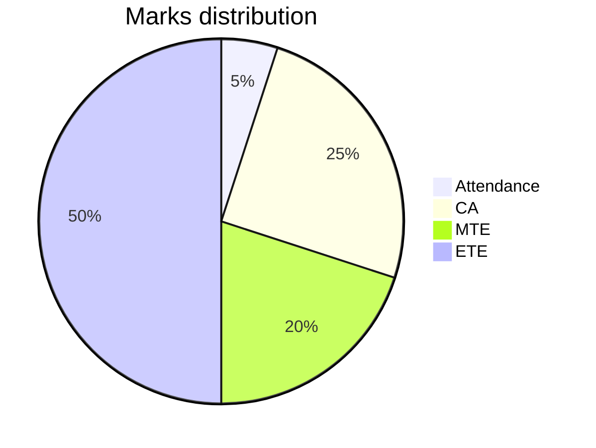

`Latest Notes: 2024/08/22 (YYYY/MM/DD), Thursday`
## Table of Content
| Content                                                   |
| ---                                                       |
| 📊[Mark Distribution](#content-markdistribution)          |
| 📑[Tests and Exams](#content-testsandexams)               |
| 🌐[MOOCs Mapped](#content-moocs)                          |
| 📝[Notes](#content-notes)                                 |
| 🔣[Formulas](#content-formulas)                           |


## <p id='content-markdistribution'>Mark Distribution📊</p>



## <p id='content-testsandexams'>Tests and Exams📑</p>
- ### Types of assessments
    | Types                                                     |
    | ---                                                       |
    | [Continuous Assessment](#content-continuousassessment)    |
    | [Mid Term](#content-midterm)                              |
    | [End Term](#content-endterm)                              |
- All Exams (CAs, MTE and ETE) are MCQ-Based

- ### <p id='content-continuousassessment'>Continuous Assessment</p>
    - Best 2 out of 3
    - All CAs are MCQ-Based

    | CA    | Date          | Modes     |
    | ---   | ---           | ---       |
    | CA 1  | 2024.09.02    | Offline   |
    | CA 2  | Before MTE    | nil       |
    | CA 3  | After MTE     | nil       |
    - CA 1:
        - 30 questions


- ### <p id='content-midterm'>Mid Term</p>


- ### <p id='content-endterm'>End Term</p>


## <p id='content-moocs'>MOOCs Mapped🌐</p>


## <p id='content-notes'>Notes📝</p>
| Unit Number               | Name                                                                |
| ------------------------- | ------------------------------------------------------------------- |
| [Unit 1](#unit1-chapter1) | Finite Automata                                                     |
| [Unit 2](#unit2-chapter1) | Regular Expressions and Regular sets                                |
| [Unit 3](#unit3-chapter1) | Formal Languages<br>Regular grammars                                |
| [Unit 4](#unit1)          | Content-free languages<br>Simplification of context - free grammars |
| [Unit 5](#unit1)          | Pushdown automata and parsing                                       |
| [Unit 6](#unit1)          | Turning machines and complexity                                     |

### <p id='unit1-chapter1'>Unit 1 Chapter 1: Finite Automata</p>
- #### Terminology:
    - ##### Language (L):
        - Set of strings that are finite/infinite
    - ##### String (Σ):
        - Any finite sequence/combination of input symbol
    - ##### Input Alphabet:
    - ##### Number:

- #### Representation of a language:
    - ##### Formal Way:
        - Grammar
        - Machine
        - Regular expression
    - ##### Imformal Way:
        - Listing
        - Statement
        - Set Builder
- #### Operations:
    - ##### String Operations:
        - Length/cardinality:
            - String of length '0' is ε

            - Formula:
                - $|\Sigma|^n$

            - It does follow Commutative Property
        
        - Concatenation:
            - In most cases, it does not follow Commutative Property
                - $uv \ne vu$
            - It follows Associative Property
            - Identity element is $\epsilon$
                - $u \cdot \epsilon = u$
                - $\epsilon \cdot u = u$
                
        - Reversal ($^R$):
            - It does not follow commutative property
                $$
                (uv)^R = v^R u^R \\
                (uv)^R \ne (vu)^R
                $$
        
        - Power:
            - `Important Notes`:
                - Here, $(ab)^2 = ab \cdot ab$
                - While in maths, its $(ab)^2 = a^2 b^2$
        
        - Kleen Closure:
            - "*Set of all languages*"
            - Formula:
                - $\Sigma^* = \Sigma^1 + \Sigma^2 + \Sigma^3 + \dots + \infty$
        
        - Positive Closure:
            - "*Set of all languages except $\epsilon$*"
            - Formula:
                - $\Sigma^+ = \Sigma^* - \epsilon$
        
        - Prefix:
            - $Count() = n + 1$
            - The "+1" here indicates $ε$
        
        - Suffix:
            - $Count() = n + 1$
            - The "+1" here indicates $ε$
        
        - Substring:
            - Prefix(s) ∪ Suffix(s) ⊆ Substring(s)
            - $Count(\text{Substring of length n}) = n\times\dfrac{n + 1}{2}+1$
        
        - Idempotent:

    - ##### Language Operations:
        - Length
        - Union
        - Intersection
        - Concatenation
        - Kleen Closure:
            - "*A set of all languages*"
            - Formula:
                - $L^* = L^1 + L^2 + \dots + \infty$
        - Positive Closure:
            - "*An infinite set of all positive strings of all possible lengths excluding ε*"
            - Mostly, $L^+=L^*-\{\epsilon\}$
                
                - An example that breaks this property:
                    - $L = \{a\}$
        - Reversal
        - Compliment
    
    - Other Notes:
        - Language with a null string:
            - $L = \epsilon$

- #### Ways of representing machines:
    - Transition Diagram
    - Transition Table
    - Via 5 Tuples


- #### <p id='notes-fa'>Finite Automata (FA)</p>
    - "*???*"
    
    - Non-existence of the final state does not make it a Finite Automata (Correct/incorrect?)

    - Types:
        ```mermaid
        graph
            FA[Finite Automata]
            
            NFA["(NFA)
            Non Finite Automata
            "]
            
            DFA["(DFA)
            Definite Finite Automata
            "]

            FA --> NFA & DFA
        ```
        - [Non Finite Automata (NFA)](#notes-nfa)
        - [Definite Finite Automata (DFA)](#notes-dfa)
    
    - ##### <p id='notes-fa-nfatodfa'>Conversion of NFA to DFA:</p>
        - Step 1: Select the states with multiple input alphabets
        
        - Step 2: For every transition state(s) that every input alphabet of the selected state transitions to that is not a single state, make that new composite state as a new state
            - Example:
                - For, $\delta(q_0, a) = [q_1, q_2]$
                - Make $[q_1, q_2]$ a new state as:
                    ```mermaid
                    graph LR
                        state1(("q<sub>0<sub>"))
                        state2(("[q<sub>1</sub>, q<sub>2</sub>]"))
                        state1 --> |a| state2
                    ```

        - Step 3: For every composite state that was formed from the previous step, find the transition state for every input alphabet of that state
            - Example:
                - $\delta([q_1, q_2], a) = ...$
                - $\delta([q_1, q_2], b) = ...$
                - $\delta([q_1, q_2], ...) = ...$
        
        - Step 4: Repeat step 1 to step step 3 will all the existing states and newly created states has all transition states defined for every input alphabet, to satisfy [condition 1](#notes-dfa-conditions-1) for a DFA machine


    - ##### <p id='notes-fa-dfatonfa'>Conversion of DFA to NFA:</p>
        - Step 1:


- #### <p id='notes-nfa'>Non Finite Automata (NFA)</p>
    - "*Non-deterministic indicates that the automaton can transition to multiple possible next states from a given state for a particular input symbol.*" 
    
    - The 5 Tuples:
        - Present State (Q)
        - Input Alphabets (Σ)
        - Transition Function (δ)
            - States are represented as $\delta(q_0, a) = \{q_1\}$
            
            - Where, *a* is an input alphabet, and *q<sub>1</sub>* is the transition state
            
            - There may be more than one transition state for a NFA
        
        - Starting State (q)
        - Final State (F)
    
    - States also accounts for combinations of a set of present states
        - $q_1q_2 = q_2q_1$
    
    - Power set:
        - "*Maximum number of possible transition states*"
        - Formula:
            - $\delta : Q \times \Sigma \rightarrow 2^Q$


- #### <p id='notes-dfa'>Definite Finite Automata (DFA):</p>
    - "*An automata where for each state and input symbol, there is exactly one possible next state*"
    
    - ##### Conditions:
        - <p id='notes-dfa-conditions-1'>Condition 1</p>
            
            - Every state must be defined for every input alphabet
        
        - <p id='notes-dfa-conditions-2'>Condition 2</p>
            
            - At every state, for every input, the output state must be single
    
    - ##### Relation between states of DFA and NFA
        - Count(MaxPossible(DFA.states())) = $2^n$, n = count(NFA.states())
    
    - ##### Minimization of DFA:
        - "*To minimize the number of states of a DFA without affecting the function of the machine*"
        
        - Steps:
            - Remove the unreachable states
            
            - Isolate the final state from the non-final state
            
            - Separate the non-final states that directly point towards the final state from the ones that do not

            - Implementation in Lua:
                ```lua
                for family in Machine.Statefamilies()
                    for int i=1, i<#family, i++
                        for inputCharacter in Machine.inputCharacters()
                            if(Machine.transitionState(family[i], inputCharacter) == Machine.transitionState(family[i], inputCharacter)  then
                            continue 
                            else
                                seperate(family[i], family[i+1])
                            end
                        end
                    end
                end
                ```
            - "*In each family of state, for each pair of individual states in that family of states*, if the family of their individual transition states are equivalent for each input alphabet, then they should stay united, else split them apart"
        
    - [Conversion of DFA to NFA](#notes-fa-nfatodfa)

- Note:
    - All strings means all strings like {a, b, c, d, e, ...}
    


- #### <p id='notes-mealymachine'>Mealy Machine</p>
    - "*A machine where its output is associated with its input*"

    - Properties:
        - It has no final state
    
    - Whenever a state is entered, the "value" of the input alphabet is concatenated
        - The $length_{output} = length_\text{input string}$
    
    - Tuples:
        - States (Q)
        - Input alphabet (Σ)
        - Transition Function (δ)
        - Initial State (q)
        - Final State (F)
        - Output Symbol (Δ)
        - Output Function (λ)
    
    - Example:
        ```mermaid
        graph LR
            state1(("q<sub>1</sub>"))
            state2(("q<sub>2</sub>"))

            state1 --> |a/0| state1
            state1 --> |b/1| state2
            state2 --> |a/1, b/1| state2
        ```
        - Here:
            - $\Sigma = \{a, b\}$
            - $\Delta = \{0, 1\}$
        
        - If, input string = aab, then output string = 001


- #### <p id='notes-moooremachine'>Moore Machine</p>
    - "*A machine where its output is associated with its state*"

    - Properties:
        - It has no final state
    
    - Whenever a state is entered, the "value" of the state is concatenated
        - The $length_{output} = length_\text{input string}+1$
        - Here, the "+1" indicates the entry into the initial state of the Moore machine
    
    - Tuples:
        - States (Q)
        - Input alphabet (Σ)
        - Transition Function (δ)
        - Initial State (q)
        - Final State (F)
        - Output Symbol (Δ)
        - Output Function (λ)
    
    - Example:
        ```mermaid
        graph LR
            state1(("q<sub>1</sub>/0"))
            state2(("q<sub>2</sub>/1"))

            state1 --> |a| state1
            state1 --> |b| state2
            state2 --> |a, b| state2
        ```
        - Here:
            - $Input\ Alphabet, \Sigma = \{a, b\}$
            - $Output\ symbol, \Delta = \{0, 1\}$
        
        - If, input string = aab, then output string = 0001


### <p id='unit2-chapter1'>Unit 2 Chapter 1: Regular Expressions and Regular Sets</p>
- #### Regular Language
    - "*A language that is accepted by a [finite automata](#notes-fa) machine*"


- #### Regular Expression
    - "*An expression defined by a recursive method*"
    
    - Properties:
        - NULL is a regular expression
            - The regular set can be defined as $L (\epsilon) = \{\epsilon\}$
        
        - Φ is a regular expression
            - The language is called an empty language
            - It is defined as $L (\phi) = \{\}$
        
        - $a$ is a regular expression if $a\ \epsilon\  \Sigma$
    
    - Identities:
        - If, $R$ is a Regular Expression, then:
            - $R+R=R$
            - $R\cdot R = R$
            - $R \cdot R^* = R$
            - $(R^*)^* = R^*$
            - $\lambda + RR^* = \lambda + RR^*, \quad [\text{By Ardens Theorem}]$
            - $\lambda^* = \lambda$
            - $\lambda \cdot R = R \cdot \lambda = R$
            - $\phi^* = \lambda$
            - $\phi + R = R + \phi = R$
            - $\phi\cdot R = R\cdot\phi = \phi$
        - If, $P$ and $Q$ are both regular expression, then
            - $(P+Q)^* = (P^*+Q^*)^* = (P^* \cdot Q^*)^*$


- #### <p id='notes-myhillnerodetheorem'>Myhill–Nerode theorem</p>
    - "*Is minimizes the DFA and also test the if the language is regular or not*"

    - ##### Formal Definition:
        - If, L be any language over Σ*, then consider 2 strings A and B, where $\{A, B\  \epsilon \ \Sigma^*\}$, are said to be in the same class if all possible string Z, where $\{Z\ \epsilon\ \Sigma^*\}$, either both *AZ* and *BZ* are in L or they are not

- #### <p id='notes-ardenstheorem'>Ardens Theorem</p>
    - "*It finds the regular expression of a [finite automata](#notes-fa) machine*"

    - Formal Definition:
        - Let $P$ and $Q$ be two regular expression over input alphabet $\Sigma$
        - if $P$ does not contain $NULL$ string, then
            - The equation $R = Q+RP$ will have a unique solution $R = QP^*$

            - Derivation:
                $$\begin{split}
                R & = Q+QP^*P \\
                & = Q(\epsilon + P^*P),\quad[\because \text{Taking common produces a single expression}] \\
                & = QP^* \\
                \vdots
                \end{split}
                $$


### <p id='unit3-chapter1'>Unit 3 Chapter 1: Formal Languages</p>
- #### Grammar
    - "*Grammar is the finite set of formal rules for generating syntactically correct sentences*"
- #### Chomsky Classification of Languages
    - "*Classification based on grammar*"
    
    | Grammar Type | Grammar accepted          | Language Accepted             | Automaton              |
    | ------------ | ------------------------- | ----------------------------- | ---------------------- |
    | Type 0       | Unrestricted Grammar      | Recursive enumerable language | Turing Machine         |
    | Type 1       | Context-Sensitive Grammar | Context-Sensitive Language    | Linear Bound Automaton |
    | Type 2       | Context-Free Grammar      | Context-Free Language         | Push-Down Automaton    |
    | Type 3       | Regular Grammar           | Regular Language              | Finite Automaton       |

    - ##### More about the types:
        - Type 0:
            - Its grammar is also called "*unbounded grammar*"
        
        - Type 3:
            - Its grammar is also called "*strictly regular grammar*"

    - ##### Conditions for each type:
        - Type 0:
            $$
            \alpha \rightarrow \beta,\ where\\
            \alpha = (T\cup N)^*N(T\cup N)^*\\
            and,\quad\beta = (T\cup N)^*
            $$
        
        - Type 1:
            $$
            \alpha \rightarrow \beta,\ where \\
            |\alpha| \le |\beta| \\
            and, \beta = (V\cup T)^+
            $$
        
        - Type 2:
            $$
            \alpha \rightarrow \beta,\ where \\
            |\alpha| = 1\quad \&\quad \alpha = V \\
            and, \quad \beta = (V\cup T)^*
            $$
        
        - Type 3:
            $$
            \alpha \rightarrow \beta,\ where\\
            |\alpha| = 1 \quad \& \quad \alpha = V \\
            and, \beta \text{ is either Left Linear Grammar (LLG) or Right Linear Grammar (RLG)}
            $$


### Unit 3 Chapter 2
### Unit 4 Chapter 1
### Unit 4 Chapter 2
### Unit 5 Chapter 1
### Unit 6 Chapter 1

## <p id='content-formulas'>Formulas🔣</p>
- ### Unit 1 Chapter 1:

    | Purpose                                       | Formula                                                               |
    | --------------------------------------------- | --------------------------------------------------------------------- |
    | Count(String of length n)                     | \|Σ\|<sup>n</sup>                                                     |
    | Set of all languages                          | Σ<sup>*</sup> = Σ<sup>1</sup> + Σ<sup>2</sup> + Σ<sup>3</sup> +...+ ∞ |
    | Positive Closure of a string                  | Σ<sup>+</sup> = Σ<sup>*</sup> - ε                                     |
    | Count(???prefix)                              | n + 1                                                                 |
    | Count(???suffix)                              | n + 1                                                                 |
    | Relation between prefix, suffix and substring | Prefix(s) ∪ Suffix(s) ⊆ Substring(s)                                  |
    | Count(Substring of length n)                  | $n\times\dfrac{n + 1}{2}+1$                                           |
    | Mostly, Positive Closure of a language        | L<sup>+</sup> = L<sup>*</sup> - {ε}                                   |
    | Number of Possible States (NFA)               | δ : Q x {Σ U ε} ⟶ 2<sup>Q</sup>                                      |
    | Number of Possible States (FA)                | δ : Q x Σ = Q                                                         |
    | Count(MaxPossible(DFA.states()))              | 2<sup>n</sup>, n = count(NFA.states())                                |
    | In Moore Machine, $length_{output}$           | $length_\text{input string} + 1$                                      |
    | In Mealy Machine, $length_{output}$           | $length_\text{input string}$                                          |


## Exam Crunch
- Probably not Noted/integrated yet:
    | Goal          | Formula                        |
    | ------------- | ------------------------------ |
    | Mealy Machine | $\lambda:Q\times\Sigma=\Delta$ |
    | Moore Machine | $\lambda : Q = \Delta$         |

### U2
- #### Regular Expression:
    - Properties:
        | Operation    | Result  |
        | ------------ | ------- |
        | Union        | Regular |
        | Intersection | Regular |
        | Complement   | Regular |
        | Difference   | Regular |

### U3
- #### Grammar:
    - "Grammar, *It is denoted by the letter 'G'*"
    - Founder:
        - Noam Chomsky
    
    - ##### Components of grammar:
        | Component           | Denotation |
        | ------------------- | ---------- |
        | Terminal Symbol     | T          |
        | Non-Terminal Symbol | N/V        |
        | Start               | S          |
        | Production Rule     | nil        |
    
    - ##### Variables:
        - Uppercase alphabet, including the starting symbol, `S`
    
    - Example:
        - $G:(\{S,A\}, \{a,b\}, S, \{S \rightarrow aAb,aA \rightarrow aaAb, A \rightarrow \epsilon\})$
    
    - ##### For conversion of $Grammar \rightarrow Language$
        - Use the production rules to decompose the strings into terminals only

        - Example:
            - The grammar, $G:(\{S,A\}, \{a,b\}, S, \{S \rightarrow aAb,aA \rightarrow aaAb, A \rightarrow \epsilon\})$, would produce the language, $L(G)=aaabbb$

            - The grammar, $G:(\{S\}, \{a\}, \{S \rightarrow SS\}, S)$, would procude the language, $L(G)=\phi$, since the result has no terminal on the R.H.S
    
    - ##### For conversion of $Language \rightarrow Grammar$
        - Example:
            - The language, $L = \{a^n b^nc^i | n \ge 1, i \ge 0\}$

### U4
- #### Types of Grammar:
    | Type | Grammar                   | Language                      | Machine Name          |
    | ---- | ------------------------- | ----------------------------- | --------------------- |
    | 0    | Unrestricted Grammar      | Recursive enumerable language | Turing Machine        |
    | 1    | Context sensitive grammar | Context sensitive language    | Linear bound automata |
    | 2    | Context free grammar      | Context free language         | Push down automata    |
    | 3    | Regular grammar           | Regular language              | Finite Automata       |

    - Others information:
        - $T_0$  grammar is also called universal/unrestricted grammar
        
- #### Rules of Grammar:
    - ##### Type 0:
        $$
        \alpha \rightarrow \beta,\ \text{where}\\
        \alpha = (T \cup V),\ \text{and}\\
        \beta = (T \cup V)^*V(T \cup V)^*
        $$
    
    - ##### Type 1:
        $$
        \alpha \rightarrow \beta,\ \text{where}\\
        |\alpha| \le |\beta|,\\
        \alpha = (T \cup V)^*V(T \cup V)^*,\ \text{and}\\
        \beta = (T \cup V)^+
        $$
    
    - ##### Type 2:
        $$
        \alpha \rightarrow \beta,\ \text{where}\\
        |\alpha| = 1,\\
        \alpha = V,\ \text{and}\\
        \beta = (T \cup V)^*
        $$
    
    - ##### Type 3:
        $$
        \alpha \rightarrow \beta,\ \text{where}\\
        | \alpha | = 1,\\
        \alpha = V,\ \text{and}\\
        \beta \ \text{is Left Linear Grammar (LLG)/Right Linear Grammar (RLL)}
        $$

- #### About Left and Right Linear Grammar:
    - Difference
         | Left Linear        | Right Linear       |
         | ------------------ | ------------------ |
         | $S \rightarrow Aa$ | $S \rightarrow aA$ |
    
    - Invalid grammar:
        - Conflicts in a grammar $G$, where:
            $$
            S \rightarrow Aa,\ \text{which is LLG}\\
            A \rightarrow aB,  \text{which is RLG}
            $$
    
    - Niche, but valid grammar: 
        - No sides, In a grammar $G$, where:
            $$S \rightarrow aAb???$$

- #### $Grammar \rightarrow Language$
    - Example:
        $$
        Language, L=\{wcw^T|w\in\ \{a,b\}^*\},\ \text{where}\\
        w^T \text{is the reverse of}\ w\\
        \\
        \text{Here, Grammar,}\ G=\{\{S\}, \{a,b,c\},P,S\},\ \\\text{where, P is the following set of production rules}\\
        \\
        P = {S \rightarrow aSa\ |\ bSb\ |\ c}
        $$

- #### Regular Grammar to Regular Expression:
    | Regular Grammar                  | Regular Expression |
    | -------------------------------- | ------------------ |
    | $A \rightarrow \alpha A / \beta$ | $\alpha ^* \beta$  |
    | $A \rightarrow A \alpha / \beta$ | $\beta ^* \alpha$  |
    | $A \rightarrow 01A \vert 00$     | $(01)^*00$         |
    | $\vdots$                         | $\vdots$           |

- #### Recursive Enumerable Language & Recursive Language:
    - $\text{Scenario 1: Language},\ L, \text{is REL, if there is Turing Machine}$
    
    - $\text{Scenario 2: Language},\ L, \text{is REL, if there is halting or total Turing Machine}$

    - $\text{Scenario 3}$
    - $\text{Scenario 4}$
    - $\text{Scenario 5}$
    - $\text{Scenario 6}$

- #### Regular Expression to Finite Automata:
    - !!!Regular expression to Transition diagrams

- #### Regular Expression to Regular Grammar:
    - Example:
        $$
        \text{For a Regular Expression, }RE = (a+ba)^*b\\
        \text{Construct a machine, where for each input alphabet in each path, create a new state for it}\\
        $$
    - Note:
        - A production rule $\alpha \rightarrow \beta$,  where $\beta$ produces no variable $V$, indicates a transition to a final state
    

- #### LLG to RRL and Vice Versa:
    | LLG                     | RRG                       |
    | ----------------------- | ------------------------- |
    | In-degree consideration | Out-degree considerations |
    | Towards the state       | Away from the state       |

### U4
- #### Derivation:
    - Types:
        - Leftmost derivation
        - Rightmost derivation
    
- #### Ambiguous grammar

- #### Unambiguous grammar

- #### Parse tree:
    - It is the graphical representation of symbols

    - Root node is the start node
    
    - It follows the precedence of operators

    - ##### Construction of a parse tree:
        - The higher the (precedence/order of operation), the lower the operation would be in the parse tree
    
    - ##### Construction of the parse tree's production rule:
        - The higher the (precedence/order of operation), the more nested the production rule
        
        - Restrictions:
            | $L \rightarrow R$         | $R \rightarrow L$        |
            | ------------------------- | ------------------------ |
            | Right restriction         | Left restriction         |
            | $A\ + \ \dots$            | $\dots \ \uparrow \ A$   |
            | Expands towards the right | Expands towards the left |
    
    - ##### Rules:
        - Every Non-Terminal/Variable, $V$ should have an operator between them

    - ##### Direction of operators:
        | Operator | Symbol     | Direction                              |
        | -------- | ---------- | -------------------------------------- |
        | Power    | $\uparrow$ | $\text{Right} \rightarrow \text{Left}$ |

- #### $\text{Ambiguous Grammar} \rightarrow \text{Unambiguous Grammar}$
    - Considerations on precedence and associativity:
        - If the precedence and associativity are the same, then direction would be from $\text{Left} \rightarrow \text{Right}$

    

- #### Pumping Lemma for CF Language
    - "*To prove that a grammar is not a Context Free Grammar (CFG)*"

    $$
    w \in L\\
    |w| \ge p\\
    w=u\ v\ x\ y\ z\\
    |vy| \gt 0,\ \text{meaning, }vy\ne \epsilon\\
    |vxy| \le p, \text{where, }p\ \text{is the  pumping length}\\
    u\ v^i\ x\ y^i\ z \in L,\ \text{where, }i \ge 0
    $$

- #### Unit production:
    - Unit production is a production rule where:
    $$
    \alpha \rightarrow \beta,\text{ and}\\
    \beta \in V\\
    $$
    
    - ##### Removal of unit production:

- #### Null Production:
    - Unit production is a production rule where:
    $$
    \alpha \rightarrow \beta,\text{ and}\\
    \alpha \in V\\
    \vert \alpha \vert = 1\\
    \beta = \epsilon
    $$

    - ##### Removal of null production:

- #### Chomsky Normal Form (CNF):
    - "*To generate all possible patterns of strings in programming languages*"
    
    - ##### Conditions to abide by (If violated, they would not be considered GNF):
        | Condition                                   | Production Rule          |
        | ------------------------------------------- | ------------------------ |
        | Starting Symbol can generate $\epsilon$ | $A \rightarrow \epsilon$ |
        | Variable generating can 1 Terminal          | $A \rightarrow a$        |
        | Variable generating can 2 Variable          | $A \rightarrow BC$       |
    
    - ##### Conversion of $CFG \rightarrow CNF$
        - Eliminate starting symbol from R.H.S
        - Remove:
            - Null production rules
            - Unit production rules
            - Any useless production rules
        
        - Following the conditions for CNF, If the RHS has:
            - Any $T$ with any other $T$ or $V$, then create a new rule which would be available to the new grammar
                - Example:
                    - Grammar, $G$, as:
                        $$
                        S \rightarrow Aa
                        $$
                    
                    - Would be in CNF as:
                        $$
                        S \rightarrow AB\\
                        B \rightarrow a
                        $$
            
            - Any $|V| \gt 2$, decompose the production rule
        

- #### Greibach Normal Form (GNF):
    - "**"

    - Conditions to abide by (If violated, they would not be considered GNF):
        | Condition                                                                                | Rule                     |
        | ---------------------------------------------------------------------------------------- | ------------------------ |
        | Starting Symbol can generate $\epsilon$                                                  | $S \rightarrow \epsilon$ |
        | A $V$ may can generate 1 $T$                                                             | $A \rightarrow a$        |
        | A $V$ may can generate a $T$ followed by a number of $V$, i.e, basically Right Recursion | $A \rightarrow aA^+$     |

    - ##### Conversion of $CNF \rightarrow GNF$:
        - Eliminate any Left Recursion, if they exist
            - Example:
                $$
                A \rightarrow Aa\ /\ b,\text{ [This is not in CNF]}\\
                A' \rightarrow bA'\ /aA'\ / \epsilon
                $$

### U5: Push Down Automata
- "**"

- Properties:
    - Remembers an infinite ($\infty$) amount of information, while DFA remembers only a finite amount

- Composition:
    - $PDA = \text{Finite State Machine} + \text{a stack}$

- Components:
    - Input Tape
    
    - Control Unit
    
    - Stack with infinite ($\infty$) size

- #### About the stack:
    - It is utilized since no positional data is needed

    - Operations:
        - Push

        - Pop

        - Skip

- #### Tuples:
    | Tuple                        | Denotation |
    | ---------------------------- | ---------- |
    | Initial State                | $Q$        |
    | Input Alphabet               | $\Sigma$   |
    | Transition Function          | $\delta$   |
    | Final State                  | $F$        |
    | Initial Element of the stack | $Z$        |
    | Element in the stack         | $\Gamma$   |

- #### About hte transition function ($\delta$):
    $$
    \delta: Q \times \{\Sigma \times \epsilon\} \times \Gamma\\
    \implies \delta:Q \times \Gamma^*
    $$

- Create a PDA from a given language:
    - Example:
        - $\text{Language, }L = a^nb^m,\ n \ge 0$

- #### LR(k) and LL(k):
    - The Initial L starts for "left-to-right"

    - $k$ represents the number of lookahead symbols
        - Typically k is 1, and if omitted, it is assumed to be 1 
    
    - Difference:
        | LR(k)                | LL(k)                |
        | -------------------- | -------------------- |
        | Rightmost Derivation | Rightmost Derivation |
        | Bottom-Up Approach   | Top-Down Approach    |


### U6: Turing Machine
- Tuples:
    | Tuples              | Denotation |
    | ------------------- | ---------- |
    | States              | $Q$        |
    | Input Alphabet      | $\Sigma$   |
    | Transition Function | $\delta$   |
    | Final State         | $F$        |
    | Initial State       | $q_0$      |
    | Blank space         | $B$        |

- Operations:
    - $T \rightarrow \text{Replace with X/same T, move Right/Left}$

- #### Given a language, construct a Turing machine
    - Example:
        $$
        \text{Language, }L=a^nb^n\ \vert\ n \ge 1,\ \text{where string is }aaabbb
        $$

- #### Transducer


### Revision Needed
- Moore to Mealy and vice versa
- Language to Grammar, in Recursive language
- Evaluate the type of machine just from the production rules
- CFG
    - Capabilities
    - Applications
    - About efficient Parser
    - Associativity and precedence
    - About Structure and parenthesis
    - Derivation

- PDA:
    - Non-Deterministic Push Down Automata (NDPDA)
    - Deterministic Push Down Automata (DPA)
    - LR(k) and LL(k)

- Turing Machine:;
    - Transducer
    - Multi-track turing machine
    - Linear Bound Automata?
        - Only a single blank space $B$ is present at the ends/stop points
        
        - Track Size depends on the size of input
    - Non-Deterministic turing machine (NDTM) VS Deterministic Turing Machine (DTM)


## <p id='content-practiceproblems'>Practice Problems</p>
### Unit 1 Chapter 1
- Find the max number of states of DFA equivalent to NFA of 10 states, out of which 3 are final states
    - Answer: $7 x 2^7$
- Minimize the number of states for the following DFA
    | Present State | 0     | 1     |
    | ---           | ---   | ---   |
    | q1            | continue from 2024.08.26 (Monday) | ? |